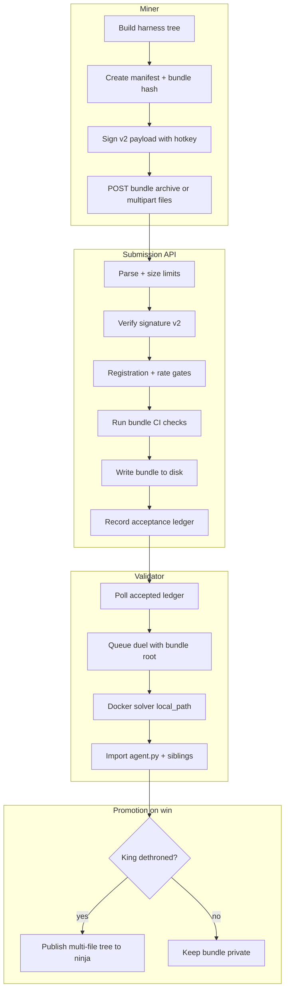

# Multi-File Private Submission Pipeline

Branch: `codex/multi-file-submission-pipeline`

## Problem

Today the private submission path is **single-file only**:

- Miners upload one `agent.py` via `POST /api/submissions` (multipart field `agent`).
- Identity is `private-submission:<id>:<sha256(agent.py)>`.
- The bundle on disk is `private-submissions/<id>/agent.py`.
- CI (scope guard + LLM judge) diffs submitted `agent.py` against the current public base `agent.py`.
- Promotion publishes only the winning `agent.py` back into `unarbos/ninja`.

The **docker solver already runs multi-file agents** when given a directory root (`SolverAgentSource.kind=local_path`): sibling modules are importable and the harness adds the agent directory to `sys.path`. The gap is entirely in **intake, attestation, storage, validation, and promotion**.

## Goal

Allow miners to submit a **directory-shaped harness** (e.g. `agent.py` + helper modules / package tree) while preserving:

- hotkey signature binding
- one accepted submission per registration
- mechanical contract checks (stdlib-only, no provider bypass, `solve(...)` preserved)
- LLM judge gatekeeping
- backward compatibility with existing v1 single-file submissions

## Architecture Overview



## Bundle Layout

Accepted bundles live under the existing private root:

```text
private-submissions/<submission-id>/
  manifest.json          # version, entrypoint, per-file metadata
  files/
    agent.py             # required entrypoint; defines solve(...)
    helper.py            # optional sibling module
    pkg/__init__.py      # optional package subtree
  check_result.json      # unchanged shape; bundle_sha256 replaces agent_sha256
```

### `manifest.json` (v1)

```json
{
  "version": 1,
  "entrypoint": "agent.py",
  "bundle_sha256": "<canonical hash>",
  "files": [
    {"path": "agent.py", "sha256": "...", "size": 12345},
    {"path": "helper.py", "sha256": "...", "size": 678}
  ]
}
```

**Canonical bundle hash** — deterministic, path-sorted:

```text
sha256( join("\n", sorted(f"{path}:{sha256(content)}" for path in files)) )
```

This replaces `sha256(agent.py)` as the commitment tail and ledger field. v1 bundles without `manifest.json` continue to use `agent_sha256` only.

## Upload Formats

Support two equivalent encodings (API picks by `Content-Type` / form fields):

| Mode | Transport | Notes |
|------|-----------|-------|
| **v1 compat** | multipart field `agent` | Single file; existing clients unchanged |
| **v2 archive** | multipart field `bundle` (`application/gzip` tar.gz or zip) | Paths relative to archive root; must include `agent.py` |
| **v2 explicit** | multipart repeated `files[]` + optional `paths[]` | For small trees; server builds manifest |

Optional field `submission_format=v2` disambiguates when both `agent` and `bundle` are absent.

Size limits (initial proposal):

- max request bytes: 5 MB (unchanged default)
- max bundle bytes: 5 MB total uncompressed
- max files: 64
- max path depth: 8
- allowed extensions: `.py` only (phase 1)

## Attestation

### Signature payload v2

```text
tau-private-submission-v2:<hotkey>:<submission-id>:<bundle_sha256>
```

v1 payloads remain valid for single-file uploads:

```text
tau-private-submission-v1:<hotkey>:<submission-id>:<agent_sha256>
```

The API accepts either; `check_result.json` records `signature_version` and the hash field used.

### On-chain commitment

Unchanged prefix, new hash semantics when v2:

```text
private-submission:<submission-id>:<bundle_sha256>
```

Validator verification loads `manifest.json` when present, else falls back to `agent.py` hash (v1).

## CI / Gatekeeping

Pipeline stages mirror today's checks, extended to the tree:

| Stage | v1 today | v2 multi-file |
|-------|----------|---------------|
| **Smoke** | py_compile + pyflakes on `agent.py` | Same on **every** `.py` file |
| **Scope guard** | patch + AST on `agent.py` | Per-file patch vs base tree; **global** forbidden import scan across all files; `agent.py` still owns protected contract markers |
| **LLM judge** | unified diff of `agent.py` | unified diff of **entire tree** vs base tree (path-prefixed); payload includes `changed_files[]` |
| **Registration gate** | unchanged | keyed on `bundle_sha256` |
| **Rate limit** | unchanged | unchanged |

Base tree source for diffs:

- Fetch current public harness from `unarbos/ninja@main` as a directory snapshot (not only `agent.py`).
- Cache base tree locally beside `--base-agent` for offline `private-submit`.

Judge prompt updates: emphasize that multi-file refactors are allowed when they improve the solver; obfuscation across files is still an attack vector.

## Validator Execution Path

Today (`validate.py`):

```python
SolverAgentSource(kind="local_file", local_path=.../agent.py, agent_file="agent.py")
```

v2:

```python
SolverAgentSource(
    kind="local_path",
    local_path=.../files,          # bundle root
    agent_file="agent.py",
    commit_sha=bundle_sha256,
)
```

`_materialize_agent_source` in `docker_solver.py` already preserves directory roots for `local_path` — no harness change required beyond pointing at the bundle directory.

## Promotion (winning king)

Today promotion overwrites a single GitHub blob at `agent.py`.

v2 promotion options (recommended: **A**):

**A. Multi-file commit to ninja (preferred)**  
Push a commit that updates/adds/deletes all paths present in the winning bundle relative to current `main`. Keeps public harness aligned with what actually ran in duels.

**B. Flatten on promotion**  
Merge helpers into `agent.py` before publish. Simpler git story but loses structure miners tested.

Phase 1 implements **A** using the GitHub Trees API (single commit, multiple path updates).

## Module Map (implementation plan)

| Module | Responsibility |
|--------|----------------|
| `src/submission_bundle.py` | Manifest, canonical hash, path validation, read/write bundle dirs |
| `src/private_submission.py` | Extend checks to accept `BundleSubmission` or v1 string |
| `src/submission_api.py` | Parse v2 uploads; dual signature verification |
| `src/cli.py` | `private-submit --bundle path/to/dir` or `--archive harness.tar.gz` |
| `src/validate.py` | Load v2 bundles; multi-file promotion |
| `tests/test_submission_bundle.py` | Hash determinism, path rules, round-trip |

## Migration / Compatibility

- Existing v1 bundles on disk keep working forever.
- Ledger entries with `agent_sha256` remain valid; new entries store `bundle_sha256` (+ optional redundant `agent_sha256` for the entrypoint file).
- Public API `/api/submissions` response adds `bundle_sha256` when present; clients that only read `agent_sha256` continue to work for v1.
- No breaking change to duel scoring or docker harness.

## Security Notes

- Reject path traversal (`../`, absolute paths, symlinks in archives).
- Reject non-`.py` files in phase 1 (no `.so`, `.pyc`, hidden dotfiles except none allowed).
- Whole-tree stdlib import scan — cannot hide forbidden imports in a helper module.
- Bundle hash includes all file paths — reordering/renaming changes identity (intentional).
- Total uncompressed size cap prevents zip bombs.

## CLI Examples (target UX)

```bash
# v2 directory submit
tau private-submit \
  --bundle ./my-harness \
  --hotkey ... --signature ...

# v2 archive submit
tau private-submit \
  --archive ./my-harness.tar.gz \
  --hotkey ... --signature ...

# v1 unchanged
tau private-submit --agent agent.py --hotkey ... --signature ...
```

## Rollout

1. **This branch** — bundle module + docs + tests (no API behavior change yet).
2. **API v2 accept** — behind `--allow-multi-file-submissions` on `serve-submissions-api`.
3. **Validator load v2** — duel against directory bundles.
4. **Multi-file promotion** — publish tree to ninja on king win.
5. **Announce** — update README + miner docs on `ninja66.ai`.
